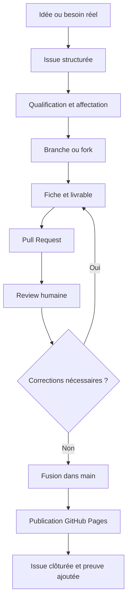

# FICHE DE CADRAGE V2

## 100 Productions IA utiles et vérifiées

**Projet collaboratif du Challenge 100 Jours — Atelier LN-IA**<br>
**Statut :** V2 validée<br>
**Date de cadrage :** 18 août 2026<br>
**Date de validation :** 18 août 2026<br>
**Date cible de lancement :** 25 septembre 2026<br>
**Responsable du projet :** Prof. Abderrahman EL HISSE<br>
**Environnement :** GitHub, GitHub Projects, GitHub Discussions, GitHub Pages, Git, VS Code et Codex<br>
**Décisions de référence :** `DECISIONS-CADRAGE-V2.md`

> **Un besoin réel → une méthode → une production → une vérification → un partage public.**

---

## 1. Résumé exécutif

Le projet **100 Productions IA utiles et vérifiées** a pour objectif de réunir les membres du Challenge 100 Jours autour d’une production collective publiée sur GitHub.

Chaque participant pourra proposer, produire, documenter, faire relire et publier un cas d’usage concret de l’intelligence artificielle.

Chaque contribution devra répondre à un besoin réel. Elle présentera la méthode utilisée, le rôle de l’humain, le résultat obtenu, les contrôles effectués, les sources et les preuves de réalisation.

Le dépôt GitHub conservera les contenus et leur historique. GitHub Projects pilotera les tâches. GitHub Discussions accueillera les échanges. Les Issues transformeront les idées en actions. Les Pull Requests organiseront la revue. GitHub Pages rendra les productions validées accessibles au public.

Le projet poursuit trois finalités :

- apprendre GitHub par la pratique
- produire une ressource collective utile
- constituer des preuves de compétences pour les participants

---

## 2. Intention du projet

Créer avant le 25 septembre 2026 un espace GitHub collaboratif capable d’accompagner la nouvelle édition du Challenge 100 Jours.

Cet espace permettra aux membres d’apprendre à contribuer à un projet numérique réel. Ils proposeront, produiront, contrôleront et publieront ensemble des ressources IA utiles au public.

Chaque contribution deviendra :

- une expérience d’apprentissage
- une preuve de compétence
- une ressource réutilisable
- une contribution au patrimoine pédagogique LN-IA
- un exemple public d’une collaboration humain–IA contrôlée

---

## 3. Proposition de valeur

### Pour les membres

- découvrir GitHub sans commencer par un projet de code complexe
- apprendre Issues, branches, commits, Pull Requests et reviews
- obtenir une reconnaissance visible de sa contribution
- enrichir son portfolio
- apprendre grâce aux productions et aux retours du collectif

### Pour le Challenge 100 Jours

- disposer d’un projet commun fédérateur
- suivre la progression réelle des membres
- transformer les séances en productions vérifiables
- capitaliser les méthodes, prompts et retours d’expérience
- préparer les soutenances à partir de preuves concrètes

### Pour le public

- accéder gratuitement à des cas d’usage compréhensibles
- réutiliser des méthodes documentées
- distinguer une simple réponse IA d’une production humaine contrôlée
- découvrir des pratiques responsables et reproductibles

---

## 4. Les cinq principes du projet

### 4.1 Apprendre en pratiquant

Rien ne remplace l’action. Chaque production transforme une connaissance en compétence.

### 4.2 Partir d’un besoin réel

Une production IA prend de la valeur lorsqu’elle répond à un problème concret.

### 4.3 Progresser par la collaboration

On apprend davantage en partageant les idées, les méthodes et les difficultés.

### 4.4 Vérifier avant de publier

L’IA propose. Le contributeur contrôle. Le collectif relit. L’humain valide.

### 4.5 Documenter pour transmettre

Chaque production présente sa méthode, ses sources, ses contrôles et ses preuves afin de devenir réutilisable.

> **Pratiquer • Collaborer • Contrôler • Documenter • Partager**

---

## 5. Objectifs

### 5.1 Objectif général

Produire et publier collectivement 100 ressources IA utiles, vérifiées et réutilisables pendant le Challenge 100 Jours.

### 5.2 Objectifs avant le lancement

Avant le 25 septembre 2026 :

- créer un dépôt GitHub opérationnel
- configurer un tableau GitHub Projects
- publier un mini-site GitHub Pages fonctionnel
- impliquer les cinq membres de l’équipe pilote validée
- valider cinq premières productions
- tester le parcours de contribution d’un débutant
- publier un guide de contribution

### 5.3 Objectifs pendant le Challenge

- atteindre 25 productions validées au premier mois
- atteindre 50 productions validées à mi-parcours
- atteindre 100 productions validées à la fin du Challenge
- former progressivement des contributeurs, relecteurs et mainteneurs
- présenter une sélection de productions lors des soutenances finales

---

## 6. Périmètre

### 6.1 Inclus dans la V1

- fiches de productions IA rédigées en Markdown
- prompts maîtres et prompts techniques utiles
- workflows humain–IA documentés
- guides, checklists et modèles réutilisables
- mini-sites et ressources pédagogiques libres de diffusion
- retours d’expérience et résolutions de problèmes
- preuves de contrôle et liens vers les livrables
- tableau GitHub Projects
- Issues, Pull Requests, reviews et Discussions
- mini-site public GitHub Pages

### 6.2 Hors périmètre de la V1

- productions contenant des données personnelles ou confidentielles
- contenus clients sans autorisation écrite
- conseils médicaux, juridiques ou financiers non expertisés
- contenus promotionnels sans valeur pédagogique
- productions sans méthode ni preuve de contrôle
- logiciels complexes nécessitant une infrastructure payante
- automatisations donnant à l’IA le droit de publier sans validation humaine
- fusion directe dans `main` sans revue

### 6.3 Évolutions possibles

- recherche et filtrage avancés sur le mini-site
- PWA installable
- traductions en arabe et en anglais
- tableaux de bord de progression
- validations automatiques des fiches
- publication multicanale
- création d’une organisation GitHub LN-IA dédiée

---

## 7. Publics concernés

### Public principal

- membres du Challenge 100 Jours
- enseignants et formateurs
- coachs et accompagnateurs
- étudiants motivés
- entrepreneurs et porteurs de projets
- professionnels souhaitant intégrer l’IA à leur activité

### Public secondaire

- associations
- établissements de formation
- communautés d’apprentissage
- citoyens cherchant des usages pratiques et responsables de l’IA

### Niveaux d’entrée

- **Découverte :** proposer une idée ou commenter une Discussion
- **Contribution guidée :** compléter une fiche à partir d’un modèle
- **Contribution GitHub :** travailler avec une branche et une Pull Request
- **Relecture :** vérifier la qualité d’une production
- **Maintenance :** organiser, arbitrer et publier les contributions

---

## 8. Catégories initiales recommandées

1. Enseigner et apprendre
2. Organiser et gérer un projet
3. Communiquer et présenter
4. Produire des documents
5. Créer un mini-site ou une application
6. Analyser des données
7. Entreprendre et développer une activité
8. Résoudre un problème numérique
9. Développer ses compétences
10. Agir de manière responsable avec l’IA

Pour l’expérience pilote, limiter le travail aux cinq catégories suivantes :

- Enseigner et apprendre
- Organiser et gérer un projet
- Communiquer et présenter
- Produire des documents
- Résoudre un problème numérique

---

## 9. Livrables attendus

### Livrables de cadrage

- fiche de cadrage validée
- charte de contribution
- grille de qualité
- règles de gouvernance
- feuille de route

### Livrables GitHub

- dépôt public configuré
- README d’accueil
- guide `CONTRIBUTING.md`
- code de conduite
- licence MIT pour le code et mention `CC BY-SA 4.0` avec attribution à LN-IA pour les contenus
- modèles d’Issues
- modèle de Pull Request
- labels normalisés
- protection de la branche `main`
- GitHub Project avec ses vues et champs
- Discussions activées

### Livrables pédagogiques

- modèle de fiche de production
- tutoriel « première contribution »
- checklist du contributeur
- checklist du relecteur
- démonstration enregistrée

### Livrables publics

- mini-site GitHub Pages
- cinq fiches pilotes validées
- catalogue des contributions
- page des contributeurs
- page de méthode et de transparence

---

## 10. Gouvernance

### 10.1 Responsable du projet

**Prof. Abderrahman EL HISSE**

Responsabilités :

- porter la vision et la finalité pédagogique
- valider le périmètre et les règles
- arbitrer les décisions structurantes
- désigner les mainteneurs
- autoriser le lancement public

### 10.2 Mainteneurs

**Mainteneur désigné au lancement :** M. BOUMRAH.

Responsabilités :

- qualifier les Issues
- affecter les contributions
- accompagner les débutants
- organiser les reviews
- protéger la cohérence du dépôt
- fusionner les Pull Requests validées
- tenir le GitHub Project à jour

### 10.3 Relecteurs

**Relecteurs désignés au lancement :** M. BOUMRAH, M. KARIM et M. YOUSSEF.

Responsabilités :

- contrôler le besoin, la méthode et le résultat
- vérifier les sources et les droits
- tester la reproductibilité lorsque cela est possible
- demander les corrections nécessaires
- rendre un avis clair : à corriger, validable ou validé

### 10.4 Contributeurs

**Contributeurs pilotes :** M. KARIM, M. Abdelmajed et M. YOUSSEF.

**Testeur du parcours débutant :** M. Abdelmajed.

Responsabilités :

- choisir ou proposer une contribution
- utiliser le modèle officiel
- documenter le rôle de l’IA et celui de l’humain
- fournir les sources, contrôles et preuves
- répondre aux commentaires de review
- respecter les règles de confidentialité et de publication

### 10.5 Testeurs et public

Responsabilités :

- consulter les productions
- signaler une erreur ou un lien cassé
- poser des questions
- proposer des améliorations

### 10.6 Principe de décision

- l’IA peut assister la rédaction, l’analyse et les vérifications
- aucune production n’est déclarée « vérifiée » par l’IA seule
- une Pull Request exige au moins une validation humaine
- le responsable du projet tranche les désaccords structurants
- seules les contributions fusionnées dans `main` sont officielles

---

## 11. Matrice simplifiée des responsabilités

| Action | Responsable du projet | Mainteneur | Relecteur | Contributeur |
|---|---|---|---|---|
| Valider le cadrage | Décide | Consulte | Consulte | Informé |
| Qualifier une idée | Consulte | Pilote | Contribue | Propose |
| Produire une fiche | Informé | Accompagne | Informé | Pilote |
| Contrôler une fiche | Arbitre | Organise | Pilote | Corrige |
| Fusionner une PR | Informé | Pilote | Autorise par avis | Informé |
| Publier le site | Autorise | Exécute | Vérifie | Informé |
| Modifier les règles | Décide | Propose | Consulte | Consulte |

---

## 12. Règles de contribution

1. Une contribution commence par une Issue.
2. Chaque Issue possède un objectif, un responsable et un statut.
3. Une seule production principale est traitée par Pull Request.
4. Le contributeur travaille sur une branche dédiée ou depuis un fork.
5. Aucun push direct dans `main` n’est autorisé.
6. Le modèle officiel de fiche doit être respecté.
7. Les sources et les droits d’utilisation doivent être indiqués.
8. Les données personnelles et confidentielles doivent être supprimées.
9. Le rôle de l’IA et les décisions humaines doivent être expliqués.
10. Une contribution doit recevoir au moins une review humaine favorable ; deux avis humains favorables sont exigés pour les contenus sensibles ou à fort impact.
11. Les corrections demandées doivent être traitées avant la fusion.
12. La fusion et la publication ne signifient pas que la fiche ne pourra plus évoluer.

---

## 13. Critères de qualité

Une production est déclarée **utile et vérifiée** lorsque les critères suivants sont satisfaits.

### Utilité

- le besoin réel est clairement formulé
- le public bénéficiaire est identifié
- le résultat apporte une réponse exploitable

### Méthode

- les étapes sont compréhensibles
- les outils et prompts sont présentés
- le rôle de l’humain est explicite

### Vérification

- les faits importants sont contrôlés
- les liens fonctionnent
- le livrable a été relu ou testé
- les limites sont signalées

### Traçabilité

- les sources sont citées
- les droits d’utilisation sont respectés
- les preuves sont accessibles
- les principales décisions sont documentées

### Réutilisation

- un autre membre peut comprendre la démarche
- les fichiers nécessaires sont disponibles
- les conditions de réutilisation sont précisées

### Conditions obligatoires avant publication

- aucune donnée sensible
- aucune source majeure manquante
- aucune erreur bloquante connue
- au moins une review humaine favorable, ou deux pour les contenus sensibles ou à fort impact
- statut GitHub Projects positionné sur `Validée`

---

## 14. Architecture recommandée du dépôt

Nom recommandé :

`cent-productions-ia-uv`

Structure V1 :

```text
cent-productions-ia-uv/
├── .github/
│   ├── ISSUE_TEMPLATE/
│   │   ├── proposer-une-production.yml
│   │   ├── demander-aide.yml
│   │   └── signaler-une-correction.yml
│   └── PULL_REQUEST_TEMPLATE.md
├── contributions/
│   ├── 01-enseigner-apprendre/
│   ├── 02-organiser-projet/
│   ├── 03-communiquer-presenter/
│   ├── 04-produire-documents/
│   ├── 05-creer-site-application/
│   ├── 06-analyser-donnees/
│   ├── 07-entreprendre/
│   ├── 08-resoudre-probleme-numerique/
│   ├── 09-developper-competences/
│   └── 10-ia-responsable/
├── docs/
│   ├── index.html
│   ├── productions.html
│   ├── contributeurs.html
│   ├── methode.html
│   └── assets/
├── gouvernance/
│   ├── CHARTE-CONTRIBUTION.md
│   ├── CRITERES-QUALITE.md
│   └── REGLES-VALIDATION.md
├── modeles/
│   ├── MODELE-FICHE-PRODUCTION.md
│   ├── CHECKLIST-CONTRIBUTEUR.md
│   └── CHECKLIST-RELECTEUR.md
├── preuves/
├── scripts/
├── CODE_OF_CONDUCT.md
├── CONTRIBUTING.md
├── LICENSE
├── README.md
└── SECURITY.md
```

### Convention de nommage des fiches

`PXXX-categorie-titre-court.md`

Exemple :

`P001-enseignement-generer-fiche-pedagogique.md`

---

## 15. Structure d’une fiche de production

Chaque fiche comporte au minimum :

1. Identifiant de la production
2. Titre
3. Auteur ou équipe
4. Catégorie
5. Besoin réel
6. Public concerné
7. Objectif
8. Données d’entrée
9. Outils utilisés
10. Prompt ou prompt maître
11. Workflow humain–IA
12. Livrable obtenu
13. Contrôles effectués
14. Sources
15. Limites
16. Preuves
17. Conditions de réutilisation
18. Relecteur et date de validation

---

## 16. Configuration du GitHub Project

Nom recommandé :

`Challenge 100J — 100 Productions IA`

### Statuts

1. Idée proposée
2. À clarifier
3. Prête à produire
4. En production
5. En revue
6. Corrections demandées
7. Validée
8. Publiée

### Champs recommandés

| Champ | Type | Usage |
|---|---|---|
| Statut | Sélection | Situer la contribution dans le workflow |
| Catégorie | Sélection | Classer la production |
| Priorité | Sélection | Basse, moyenne, haute |
| Difficulté | Sélection | Découverte, guidée, autonome, avancée |
| Contributeur | Personne | Identifier le producteur |
| Relecteur | Personne | Identifier le contrôleur |
| Phase | Sélection | Cadrage, pilote, préparation, lancement, Challenge |
| Date cible | Date | Suivre l’échéance |
| Numéro de production | Nombre | Suivre l’objectif des 100 productions |
| Validation | Sélection | Non contrôlée, en contrôle, corrections, validée |
| Lien public | Texte | Accéder à la fiche publiée |

### Vues recommandées

#### Vue 1 — Pilotage général

Table regroupée par statut avec les responsables et les dates cibles.

#### Vue 2 — Tableau des contributions

Board Kanban : Idée proposée → En production → En revue → Validée → Publiée.

#### Vue 3 — Feuille de route

Roadmap du 18 août au 25 septembre 2026 puis des 100 jours du Challenge.

#### Vue 4 — Contrôle qualité

Vue filtrée sur `En revue`, `Corrections demandées` et `Validée`.

#### Vue 5 — Productions publiées

Vue filtrée sur `Publiée` avec numéro, catégorie, auteur et lien public.

---

## 17. Labels recommandés

### Type

- `type:production`
- `type:correction`
- `type:documentation`
- `type:site`
- `type:organisation`

### État

- `etat:a-clarifier`
- `etat:pret`
- `etat:bloque`
- `etat:review`

### Niveau

- `niveau:decouverte`
- `niveau:guide`
- `niveau:autonome`
- `niveau:avance`

### Qualité

- `qualite:sources-requises`
- `qualite:test-requis`
- `qualite:correction-demandee`
- `qualite:validee`

### Catégorie

- `categorie:enseignement`
- `categorie:organisation`
- `categorie:communication`
- `categorie:document`
- `categorie:numerique`
- `categorie:responsable`

---

## 18. Premier workflow de contribution



### Étape 1 — Proposer

Le membre ouvre le formulaire `Proposer une production`.

Il indique :

- le besoin
- le bénéficiaire
- le résultat envisagé
- son niveau GitHub
- les données ou sources nécessaires

### Étape 2 — Qualifier

Un mainteneur contrôle le périmètre, les risques et la faisabilité.

L’Issue reçoit :

- un numéro de production provisoire
- une catégorie
- un niveau
- un responsable
- un relecteur
- une date cible

### Étape 3 — Produire

Le contributeur crée une branche :

`contribution/PXXX-titre-court`

Il complète la fiche officielle et ajoute le livrable ou son lien.

### Étape 4 — Contrôler avant la demande

Le contributeur utilise la checklist :

- structure complète
- orthographe relue
- sources présentes
- absence de données sensibles
- liens testés
- preuves ajoutées
- rôle de l’humain explicite

### Étape 5 — Proposer une Pull Request

La Pull Request indique :

- l’Issue associée
- la contribution ajoutée
- les contrôles déjà réalisés
- les points nécessitant une attention humaine

### Étape 6 — Réaliser la review

Le relecteur vérifie l’utilité, la méthode, la fiabilité, les droits et la réutilisation.

Il peut :

- approuver
- commenter
- demander des corrections

### Étape 7 — Fusionner

Un mainteneur fusionne uniquement après une review humaine favorable — ou deux pour un contenu sensible ou à fort impact — et le respect des critères obligatoires.

### Étape 8 — Publier et clôturer

La fiche est intégrée au mini-site. Le lien public est ajouté à l’Issue et au GitHub Project. L’Issue est clôturée avec la preuve de publication.

---

## 19. Parcours d’intégration des débutants

### Niveau 1 — Première participation

- rejoindre une Discussion
- proposer une idée avec un formulaire Issue
- commenter une production
- suivre le tableau GitHub Projects

### Niveau 2 — Première contribution guidée

- choisir une Issue simple
- modifier une fiche depuis l’interface web GitHub
- créer une branche
- ouvrir une Pull Request
- répondre à une review

### Niveau 3 — Contribution depuis VS Code

- cloner le dépôt
- créer une branche locale
- modifier et contrôler les fichiers
- réaliser un commit
- pousser la branche
- ouvrir et suivre la Pull Request

### Niveau 4 — Relecture et maintenance

- relire une contribution
- tester les liens et le livrable
- demander une correction argumentée
- mettre à jour le GitHub Project
- participer à la publication

---

## 20. Feuille de route jusqu’au 25 septembre 2026

### Du 18 au 24 août — Cadrage

- valider le titre
- définir le public
- fixer les règles de contribution
- déterminer les critères de qualité
- choisir les premières catégories
- valider la gouvernance
- sélectionner les membres pilotes

**Jalon :** fiche de cadrage V2 validée.

### Du 25 au 31 août — Construction GitHub

- créer le dépôt
- créer le GitHub Project
- préparer le README
- activer Discussions
- créer les modèles d’Issues et de Pull Requests
- établir la structure des dossiers
- configurer les labels
- protéger la branche `main`

**Jalon :** environnement GitHub prêt pour le pilote.

### Du 1er au 10 septembre — Expérience pilote

- inviter trois à cinq membres
- produire cinq premières contributions
- tester le parcours débutant
- relever les difficultés
- simplifier les instructions
- mesurer le temps nécessaire à une première contribution

**Jalon :** cinq productions relues dont au moins trois validées.

### Du 11 au 20 septembre — Préparation publique

- construire le mini-site GitHub Pages
- publier les premières fiches validées
- préparer un guide de contribution
- enregistrer une démonstration
- préparer le message d’invitation
- vérifier l’affichage sur ordinateur et smartphone

**Jalon :** mini-site public fonctionnel et parcours documenté.

### Du 21 au 24 septembre — Validation finale

- effectuer une simulation complète
- vérifier les droits et les liens
- valider le tableau GitHub Projects
- publier la feuille de route
- préparer l’accueil des nouveaux membres
- corriger les blocages du pilote
- décider l’ouverture officielle

**Jalon :** autorisation humaine de lancement.

### 25 septembre 2026 — Lancement

- publier l’annonce officielle
- ouvrir les premières Issues
- accueillir les membres
- présenter le workflow
- démarrer la première vague de contributions

---

## 21. Indicateurs de réussite

### Avant le lancement

| Indicateur | Cible |
|---|---:|
| Membres pilotes actifs | 5 |
| Contributions pilotes ouvertes | 5 |
| Contributions validées | 3 à 5 |
| Parcours débutant testé | 1 parcours complet minimum |
| Mini-site GitHub Pages | Fonctionnel |
| Guide de contribution | Publié |
| Erreurs critiques de confidentialité ou de droits | 0 |

### Pendant le Challenge

| Indicateur | Cible |
|---|---:|
| Productions au premier mois | 25 |
| Productions à mi-parcours | 50 |
| Productions à la fin | 100 |
| Productions avec review humaine | 100 % |
| Productions avec sources ou justification | 100 % |
| Liens publics fonctionnels | 95 % minimum |
| Membres ayant réalisé une Pull Request | À suivre chaque semaine |
| Membres devenus relecteurs | À développer progressivement |

---

## 22. Risques et réponses

| Risque | Effet possible | Réponse prévue |
|---|---|---|
| GitHub paraît trop complexe | Abandon des débutants | Parcours en quatre niveaux et tutoriel guidé |
| Contributions trop différentes | Catalogue incohérent | Modèle unique et catégories limitées au pilote |
| Erreurs produites par l’IA | Perte de confiance | Review humaine et critères obligatoires |
| Données personnelles publiées | Risque pour les membres | Checklist confidentialité et contrôle avant fusion |
| Sources ou droits absents | Publication non conforme | Champ obligatoire et demande de correction |
| Trop de tâches ouvertes | Dispersion | Priorités, limite du pilote et tableau Projects |
| Peu de relecteurs | Blocage des Pull Requests | Former deux à trois relecteurs dès le pilote |
| Push direct dans `main` | Perte de contrôle | Branche protégée et PR obligatoire |
| Liens cassés | Ressource inutilisable | Tests avant publication et vérification périodique |
| Objectif de 100 trop rapide | Baisse de qualité | Jalons 25, 50 et 100 avec priorité à la validation |

---

## 23. Définition d’une contribution terminée

Une contribution est terminée lorsque :

- l’Issue est qualifiée et reliée à la Pull Request
- la fiche utilise le modèle officiel
- le besoin réel et le public sont identifiés
- le workflow humain–IA est expliqué
- le livrable ou son lien est disponible
- les contrôles et limites sont documentés
- les sources et droits sont indiqués
- les preuves sont présentes
- aucune donnée sensible n’est exposée
- une review humaine favorable est enregistrée, ou deux pour un contenu sensible ou à fort impact
- la Pull Request est fusionnée dans `main`
- la fiche est visible sur GitHub Pages
- le lien public est enregistré dans GitHub Projects
- l’Issue est clôturée

---

## 24. Décisions validées avant la construction

Les huit décisions de cadrage ont été validées le 18 août 2026 par le responsable du projet. Le document de référence est `DECISIONS-CADRAGE-V2.md`.

### Décision 1 — Titre officiel

**Décision validée :** `100 Productions IA utiles et vérifiées`.

### Décision 2 — Nom du dépôt

**Décision validée :** `cent-productions-ia-uv`.

### Décision 3 — Propriétaire du dépôt

**Décision validée :** créer le dépôt pilote sur le compte GitHub `elhisse-CLPrepas`.

Un transfert vers une organisation GitHub dédiée à LN-IA pourra être étudié après le pilote.

### Décision 4 — Visibilité

**Décision validée :** dépôt public, avec une communication externe limitée pendant le pilote jusqu’à la validation des premières productions.

### Décision 5 — Licence

**Décision validée pour le code :** licence MIT.

**Décision validée pour les contenus pédagogiques :** licence Creative Commons Attribution — Partage dans les mêmes conditions 4.0 International (`CC BY-SA 4.0`), avec attribution à LN-IA.

### Décision 6 — Équipe pilote

**Décision validée :**

| Membre | Rôle principal | Rôle secondaire |
|---|---|---|
| Prof. Abderrahman EL HISSE | Responsable du projet | Arbitrage et validation |
| M. BOUMRAH | Mainteneur | Relecteur |
| M. KARIM | Relecteur | Contributeur |
| M. Abdelmajed | Contributeur | Testeur débutant |
| M. YOUSSEF | Contributeur | Relecteur |

### Décision 7 — Catégories pilotes

**Décision validée :** limiter le pilote aux cinq catégories suivantes :

1. Enseigner et apprendre
2. Organiser et gérer un projet
3. Communiquer et présenter
4. Produire des documents
5. Résoudre un problème numérique

### Décision 8 — Niveau de validation

**Décision validée :** une review humaine favorable est obligatoire pour toute fusion. Deux avis humains favorables sont exigés pour les contenus sensibles ou à fort impact. Le relecteur ne peut pas être l’unique auteur de la contribution contrôlée.

---

## 25. Checklist d’autorisation du lancement

- [x] Titre validé
- [x] Périmètre validé
- [x] Responsable et mainteneurs nommés
- [x] Membres pilotes identifiés
- [ ] Dépôt créé
- [ ] Branche `main` protégée
- [ ] GitHub Project configuré
- [ ] Discussions activées
- [ ] Modèles d’Issues opérationnels
- [ ] Modèle de Pull Request opérationnel
- [ ] README et guide de contribution publiés
- [x] Licences du code et des contenus choisies
- [ ] Cinq contributions pilotes ouvertes
- [ ] Trois à cinq contributions validées
- [ ] Mini-site GitHub Pages fonctionnel
- [ ] Liens, droits et confidentialité vérifiés
- [ ] Simulation complète réussie
- [ ] Autorisation finale donnée par le responsable du projet

---

## 26. Références techniques officielles

- [GitHub Projects — présentation](https://docs.github.com/issues/planning-and-tracking-with-projects/learning-about-projects/about-projects)
- [Planifier et suivre le travail avec GitHub Projects](https://docs.github.com/en/issues/planning-and-tracking-with-projects)
- [GitHub Issues](https://docs.github.com/issues/tracking-your-work-with-issues/about-issues)
- [Formulaires d’Issues](https://docs.github.com/en/communities/using-templates-to-encourage-useful-issues-and-pull-requests/syntax-for-issue-forms)
- [GitHub Discussions](https://docs.github.com/en/discussions/collaborating-with-your-community-using-discussions/about-discussions)
- [Pull Requests](https://docs.github.com/en/pull-requests/reference/pull-requests)
- [Branches protégées](https://docs.github.com/en/repositories/configuring-branches-and-merges-in-your-repository/managing-protected-branches/about-protected-branches)
- [Créer un site GitHub Pages](https://docs.github.com/en/pages/getting-started-with-github-pages/creating-a-github-pages-site)

---

## 27. Formule de clôture du cadrage

> **L’IA assiste. Le membre produit. Le collectif relit. L’humain valide. GitHub conserve les preuves. Le public bénéficie du résultat.**

**Prochaine action autorisée :** construire l’arborescence du dépôt pilote, initialiser Git, préparer le `README.md`, les documents de gouvernance, les modèles d’Issues et de Pull Request, puis configurer GitHub Projects.
